# Code Review Reception

## Overview

Code review requires technical evaluation, not emotional performance.

**Core principle:** Verify before implementing. Finish the batch. Close the loop on each comment before moving on.

A review pass is not complete when code changes exist. It is complete when every review comment is in a terminal state:
- `fixed` - code changed, verified, replied, resolved
- `declined` - technical reply posted, left unresolved
- `blocked` - blocker explained, left unresolved

## The Response Pattern

```
WHEN receiving code review feedback:

0. INVENTORY: List every unresolved comment/thread first
1. UNDERSTAND: Restate each requirement in your own words (or ask)
2. VERIFY: Check against codebase reality
3. DECIDE: `fixed`, `declined`, or `blocked`
4. ACT: Implement only if justified; test each code change
5. CLOSE LOOP: Reply in thread; resolve immediately if `fixed`
6. CONTINUE: Move to the next unresolved comment without waiting
7. STOP ONLY IF: A real blocker or human decision is required
```

## The Execution Loop

```dot
digraph review_loop {
    rankdir=LR;
    inventory [label="Inventory all unresolved comments", shape=box];
    verify [label="Verify current comment", shape=box];
    decide [label="fixed / declined / blocked?", shape=diamond];
    fix [label="Implement + verify", shape=box];
    reply_resolve [label="Reply + resolve", shape=box];
    reply_only [label="Reply only", shape=box];
    next [label="More comments?", shape=diamond];
    blocked [label="Explain blocker + ask human partner", shape=box];
    done [label="Review batch complete", shape=box];

    inventory -> verify;
    verify -> decide;
    decide -> fix [label="fixed"];
    decide -> reply_only [label="declined"];
    decide -> blocked [label="blocked"];
    fix -> reply_resolve;
    reply_resolve -> next;
    reply_only -> next;
    next -> verify [label="yes"];
    next -> done [label="no"];
}
```



**Default behavior:** Do not stop after the first fix. Continue until every comment is closed out as `fixed`, `declined`, or `blocked`.

## Forbidden Responses

**NEVER:**
- "You're absolutely right!" (explicit CLAUDE.md violation)
- "Great point!" / "Excellent feedback!" (performative)
- "Let me implement that now" (before verification)
- Fix one comment and wait silently for the human partner to tell you to continue
- Leave thread reply/resolve work for "later"

**INSTEAD:**
- Restate the technical requirement
- Ask clarifying questions
- Push back with technical reasoning if wrong
- Just start working (actions > words)

## Handling Unclear Feedback

```
IF an unclear item affects other comments:
  STOP - do not implement related items yet
  ASK for clarification first

IF an unclear item is isolated:
  mark it `blocked`
  continue processing the independent comments

WHY: Some comments are coupled; others are independent. Know which case you're in.
```

**Example:**
```
your human partner: "Fix 1-6"
You understand 1,2,3,6. Unclear on 4,5.

❌ WRONG: Implement 1,2,3,6 now, ask about 4,5 later
✅ RIGHT: "I understand items 1,2,3,6. Need clarification on 4 and 5 before proceeding."
```

## Source-Specific Handling

### From your human partner
- **Trusted** - implement after understanding
- **Still ask** if scope unclear
- **No performative agreement**
- **Skip to action** or technical acknowledgment

### From External Reviewers
```
BEFORE implementing:
  1. Check: Technically correct for THIS codebase?
  2. Check: Breaks existing functionality?
  3. Check: Reason for current implementation?
  4. Check: Works on all platforms/versions?
  5. Check: Does reviewer understand full context?

IF suggestion seems wrong:
  Push back with technical reasoning

IF can't easily verify:
  Say so: "I can't verify this without [X]. Should I [investigate/ask/proceed]?"

IF conflicts with your human partner's prior decisions:
  Stop and discuss with your human partner first
```

**your human partner's rule:** "External feedback - be skeptical, but check carefully"

## YAGNI Check for "Professional" Features

```
IF reviewer suggests "implementing properly":
  grep codebase for actual usage

  IF unused: "This endpoint isn't called. Remove it (YAGNI)?"
  IF used: Then implement properly
```

**your human partner's rule:** "You and reviewer both report to me. If we don't need this feature, don't add it."

## Implementation Order

```
FOR multi-item feedback:
  1. Gather every unresolved comment/thread and its ids up front
  2. Sort work in this order:
     - Blocking issues (breaks, security)
     - Clear correctness bugs
     - Simple fixes (typos, imports)
     - Complex fixes (refactoring, logic)
  3. FOR each comment:
     a. Verify the comment against THIS codebase
     b. Decide: `fixed`, `declined`, or `blocked`
     c. IF `fixed`: implement, test, verify regressions
     d. Perform thread action immediately
     e. Continue to the next comment
  4. End only when every comment has reached a terminal state
```

**Terminal state required per comment:**
- `fixed`: code updated, verification run, thread reply posted, thread resolved
- `declined`: technical reply posted, thread left unresolved
- `blocked`: blocker explained to the human partner, and in the thread if applicable

## When To Push Back

Push back when:
- Suggestion breaks existing functionality
- Reviewer lacks full context
- Violates YAGNI (unused feature)
- Technically incorrect for this stack
- Legacy/compatibility reasons exist
- Conflicts with your human partner's architectural decisions

**How to push back:**
- Use technical reasoning, not defensiveness
- Ask specific questions
- Reference working tests/code
- Involve your human partner if architectural

**Signal if uncomfortable pushing back out loud:** "Strange things are afoot at the Circle K"

## Acknowledging Correct Feedback

When feedback IS correct:
```
✅ "Fixed. [Brief description of what changed]"
✅ "Fixed in [location]. [Specific change]. [Test/verification run]."
✅ [Just fix it and show in the code]

❌ "You're absolutely right!"
❌ "Great point!"
❌ "Thanks for catching that!"
❌ "Thanks for [anything]"
❌ ANY gratitude expression
```

**Why no thanks:** Actions speak. Just fix it. The code itself shows you heard the feedback.

**If you catch yourself about to write "Thanks":** DELETE IT. State the fix instead.

## Gracefully Correcting Your Pushback

If you pushed back and were wrong:
```
✅ "You were right - I checked [X] and it does [Y]. Implementing now."
✅ "Verified this and you're correct. My initial understanding was wrong because [reason]. Fixing."

❌ Long apology
❌ Defending why you pushed back
❌ Over-explaining
```

State the correction factually and move on.

## Common Mistakes

| Mistake | Fix |
|---------|-----|
| Performative agreement | State requirement or just act |
| Blind implementation | Verify against codebase first |
| Batch without testing | One at a time, test each |
| Assuming reviewer is right | Check if breaks things |
| Avoiding pushback | Technical correctness > comfort |
| Partial implementation | Clarify all items first |
| Can't verify, proceed anyway | State limitation, ask for direction |
| Fixing one comment then stopping | Continue until all comments reach terminal states |
| Changing code but not replying/resolving | Thread closure is part of the task, not optional cleanup |

## Real Examples

**Performative Agreement (Bad):**
```
Reviewer: "Remove legacy code"
❌ "You're absolutely right! Let me remove that..."
```

**Technical Verification (Good):**
```
Reviewer: "Remove legacy code"
✅ "Checking... build target is 10.15+, this API needs 13+. Need legacy for backward compat. Current impl has wrong bundle ID - fix it or drop pre-13 support?"
```

**YAGNI (Good):**
```
Reviewer: "Implement proper metrics tracking with database, date filters, CSV export"
✅ "Grepped codebase - nothing calls this endpoint. Remove it (YAGNI)? Or is there usage I'm missing?"
```

**Unclear Item (Good):**
```
your human partner: "Fix items 1-6"
You understand 1,2,3,6. Unclear on 4,5.
✅ "Understand 1,2,3,6. Need clarification on 4 and 5 before implementing."
```

**Multi-Comment Continuation (Good):**
```
Reviewer leaves 4 comments.
You fix comment 1, run the targeted test, reply in-thread, resolve it,
then immediately move on to comment 2 without waiting for a new user prompt.
```

## GitHub Thread Closure

When replying to inline review comments on GitHub, reply in the comment thread (`gh api repos/{owner}/{repo}/pulls/{pr}/comments/{id}/replies`), not as a top-level PR comment.

**Per-comment rule:**
- `fixed`: reply with the concrete fix, then resolve the corresponding thread immediately after the fix is present on your branch
- `declined`: reply with the technical reason, do not resolve
- `blocked`: reply with the blocker or missing prerequisite if appropriate, do not resolve

**Do not defer closure work.** Reply/resolve is part of handling the current comment, not a final cleanup pass you might forget.

**Missing metadata is not permission to skip.**
- First, list unresolved review threads and ids
- Map each current comment to its thread before or during implementation
- If repo/PR/thread identifiers are truly unavailable, report exactly what is missing; do not pretend the review work is fully complete

## Resolve Discipline

After a code fix is verified and a concrete thread reply exists, resolve the corresponding review thread in the same work session. Do not leave fixed threads open.

Checklist:
1. List unresolved review threads + ids
2. Match each fixed comment to its thread id
3. Reply in thread with the concrete fix
4. Resolve that thread
5. Continue to the next unresolved comment

## The Bottom Line

**External feedback = suggestions to evaluate, not orders to follow.**

Verify. Decide. Act. Close the thread. Continue until the batch is done.

No performative agreement. Technical rigor always.
